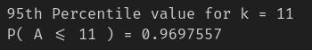
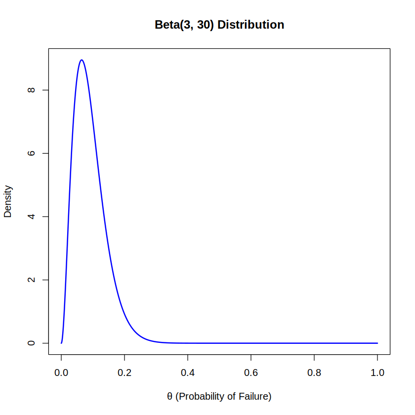
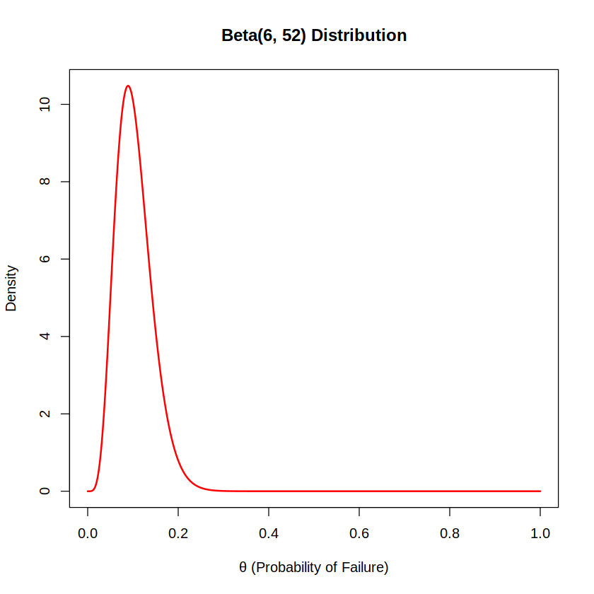
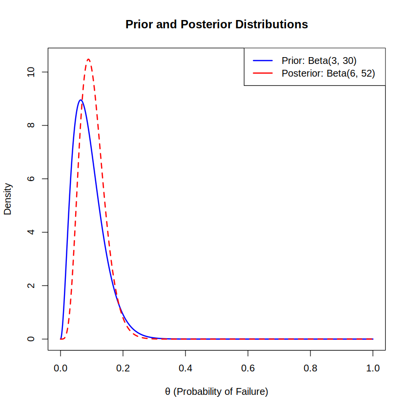
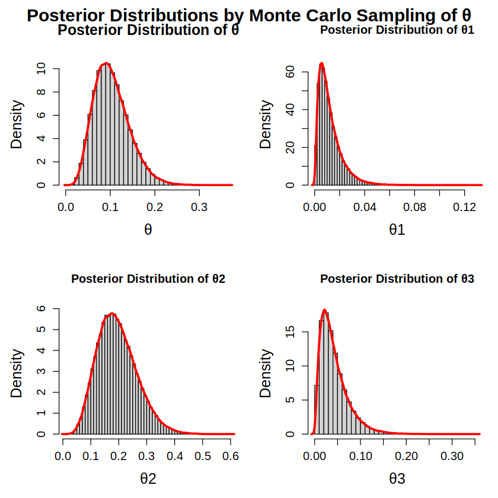
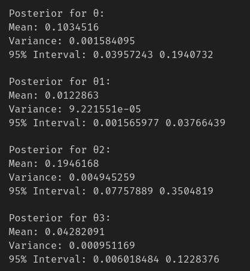

**CS7DS3 Applied Statistical Modelling**  
*Assignment 1*

Name: Harinath Babu 

Student ID: 24340502

Course: MSc in Computer Science - Data Science

# Q1
$S_2$ fails iff both components fails,
    $$P(S_2\ fails) = P(x_1\ fails\ and\ x_2\ fails)$$
Given, 
    $$P(x_1\ fails) = P(x_2\ fails) = \theta$$
Since $x_1$ & $x_2$ failing are independent, 
    $$P(S_2\ fails) = P(x_1\ fails) * P(x_2\ fails)$$
    $$\theta_1 = \theta * \theta$$
    $$\theta_1 = \theta ^ 2$$

---

# Q2
A -> Total number of observed failures

$\theta = 0.08$; $n = 1000$

Each system follows a bernoulli trial, with the two outcomes; Component failure (success in trial) or Not component failure (failure in trial). The given $n$ systems can thus be modeled with a binomial distribution with a probability of $\theta_1 = \theta^2 = 0.8 ^ 2$, and thus $\theta_1 = 0.0064$.

## i
As stated in the **Probability Review II** notes under the section **Expectation and variance of random variables** for a binomial distribution,

Expectation,
    $$\mathbb{E}[A] = n * \theta_1$$
    $$\mathbb{E}[A] = 1000 * 0.0064$$
    $$\mathbb{E}[A] = 6.4$$
Variance,
    $$\mathbb{Var}[A] = n * \theta_1 * (1 - \theta_1)$$
    $$\mathbb{Var}[A] = 1000 * 0.0064 * (1-0.0064)$$
    $$\mathbb{Var}[A] = 6.35904$$

## ii
This was done via R code using the pbinom() function. The value $P(5 <= A <= 10)$ was computed as $P(A <= 10) - P(A < 5)$ which is the same as $P(A <= 10) - P(A <= 4)$ for our trials
using `pbinom(10, 1000, 0.0064) - pbinom(4, 1000, 0.0064)`.

## iii
This value was computed using qbinom() function in R. The value of $k^*$ such that $P(A<= k^*) >= 0.95$ was computed as `qbinom(0.95, 1000, 0.0064)` and the result was checked to be strictly greater than the 95% percentile to satisfy $P(A<= k^*) > 0.95$ and the result was $k*$ = 11 was strictly greater than the 95th percentile.

---

# Q3
## i
$S_2$ fails if either of the components fail (i.e) works iff both components work,
    $$P(S_2\ works) = (1-\theta) * (1-\theta) = (1-\theta) ^ 2$$
    $$P(S_2\ fails) = \theta_2 = 1 - (1-\theta) ^ 2$$
    $$\theta_2 = 1 - (1-\theta) ^ 2$$
    $$\theta_2 = 1 - (1 + \theta^2 -  2\theta)$$
    $$\theta_2 = 2\theta - \theta^2$$

## ii
$S_3$ fails if both of its parallel components fails, where each parallel component is composed of 2 serial subcomponents $x_i$,
    $$P(S_3\ fails) = P(Parellel\ subcomponent\ 1\ fails\ and\ Parellel\ subcomponent\ 2\ fails)$$
    $$\theta_3 = \theta_2 * \theta_2 = \theta_2^2$$
    $$\theta_3 = [2\theta - \theta^2] ^ 2$$
    $$\theta_3 = 4\theta^2 + \theta^4 - 2\theta^2*(2\theta)$$
    $$\theta_3 = \theta^4 - 4\theta^3 + 4\theta^2$$

---

# Q4
The experiment can be modeled with a binomial distribution (and likelihood) with probability $\theta$, $n = 25$ experiments and $k = 3$ successes. Expert opinion suggest that there is a 5% to 10% chance each component fails, and that it is highly unusual for this to over 20%. This is the probability of failure of individual components (i.e) $\theta$.
 
## i
The specified prior is $Be(3, 30)$ with $a = 3; b = 30$. 
This is the number of expected successes and failures to be observed respectively. 

Success here is the component failure and failure is the component non-failure. 

- The beta prior is conjugate to the binomial distribution, and leads to a beta posterior (As given in the **Bayesian Inference: beta-binomial model** notes under section **Conjugacy**).

- The mean of the beta distribution is,
    $$mean = \frac{a}{a + b} = \frac{3}{3 + 30}$$
    $$mean \approx 0.09091$$
    This suggests that the expected failure is around 9.1%, which aligns well with the expert opinion that the failure rate is expected to be 5% - 10%.

- The variance is ,
    $$Var = \frac{ab}{(a+b)^2(a+b+1)}$$
    $$Var = \frac{3(30)}{(3+30)^2(3+30+1)} = \frac{90}{(33)^2(34)}$$ 
    $$Var \approx 0.00243$$
    This tells us that the values of $\theta$ are concentrated around the mean and not too spread out.

- The mode is,
    $$mode = \frac{a-1}{a+b-2} = \frac {3-1}{3+30-2}$$ 
    $$mode \approx 0.06452$$
    This tells us that the most likely value of $\theta$ is 6.45% which is consistent with the expert opinion.

- The distribution $Be(3, 30)$ is highly skewed towards lower values of $\theta$ (since $a << b$). The plot was created by generating the distribution using `dbeta(x, 3, 30)` with x ranging from 0 to 1 and plotting the results using `plot()`.   

- The probabilty of the value being over 20% (stated to be highly unlikely) under this prior is,
    $$P(\theta >= 0.20) \approx 0.03169$$
    The value was computed using pbeta() as `1 - pbeta(0.20, 3, 30)`. This gives approximately a 3.2% chance for $\theta$ values over 20% and is thus consistent with expert opinion.

*The chosen prior is thus a good match and is consistent with the expert opinion. Thus it can be used as the prior to model the parameter distribution.* 

## ii
Under the Beta-Binomial model, for the prior $Be(a, b)$ the posterior can be constructed (with $k = \Sigma x_i$) as $Be(a_n, b_n)$ where $a_n = k + a$; $b_n = n - k + b$ (As stated in the **Bayesian Inference: beta-binomial model** notes under section **Beta-binomial model**).
    $$a_n = k + a = 3 + 3$$
    $$a_n = 6$$
    $$b_n = n - k + b = 25 - 3 + 30$$
    $$b_n = 52$$

Thus the posterior distribution is $\theta|x \sim Be(6, 52)$
- The mean of the beta distribution is,
    $$mean = \frac{a}{a + b} = \frac{6}{6 + 52}$$
    $$mean \approx 0.1035$$
    This suggests that the expected failure is around 10.35%, which is a bit higher due to observed failures but aligns well with the expert opinion.

- The variance is ,
    $$Var = \frac{ab}{(a+b)^2(a+b+1)}$$
    $$Var = \frac{6(52)}{(6+52)^2(6+52+1)} = \frac{312}{(58)^2(59)}$$ 
    $$Var \approx 0.00157$$
    The extimate is now more confident and the variance has decreased.

- The mode is,
    $$mode = \frac{a-1}{a+b-2} = \frac {6-1}{6+52-2}$$ 
    $$mode \approx 0.0893$$
    This tells us that the most likely value of $\theta$ is 8.93% which has also increased due to the observed failures.

- The distribution $Be(6, 52)$ is also highly skewed towards lower values of $\theta$ (since $a << b$). The plot was created by generating the distribution using `dbeta(x, 6, 52)` with x ranging from 0 to 1 and plotting the results using `plot()`.    

## iii
- The prior mean was 0.09091(~9%) and mode was 0.06452(~6.45%), both of which which increased a bit in the posterior to 0.1035(~10.4%) and 0.0893(~8.93%).
- The variance has decreased from 0.00243(~0.24%) to 0.00157(~0.15%), which shows an increase in our certainty.
- While both the distributions are skewed towards lower values, the posterior is narrower. The plot was created by generating the distribution using `dbeta(x, 3, 30)` & `dbeta(x, 6, 52)` with x ranging from 0 to 1 and plotting the results using `plot()`.    

- The prior was strong, but not too strong as the observed data was still able to influence the posterior in a non-insignificant way.
- Since the data consisted only of 25 observations, a bit less the number of pseudo-observations in the prior (33), the selected prior is slightly more informative than the data alone in the construction of the prior but not by a huge margin as seen by the data's ability to influence the posterior

## iv

*The posterior distributions $P(\theta_1|x, \theta)$, $P(\theta_2|x, \theta)$, $P(\theta_3|x, \theta)$ are constructed by Monte-Carlo sampling of $\theta$ from the posterior distribution $P(\theta|x)$ and transformation of the sampled values in terms of $\theta_1$, $\theta_2$, and $\theta_3$*
- 100000 values from the posterior of $\theta_1$ are sampled using `rbeta(1e5, 6, 52)`. All the plots in this section are made using `hist(freq=False)` to plot the densities histogram.

- The sampled values are transformed into $\theta_1$ as `mc_post_theta_1 <- mc_post_theta ^ 2` since $\theta_1 = \theta^2$      

- The sampled values are transformed into $\theta_2$ as `mc_post_theta_2 <- (2 * mc_post_theta) - (mc_post_theta ^ 2)` since $\theta_2 = 2\theta - \theta^2$             

- The sampled values are transformed into $\theta_3$ as `mc_post_theta_3 <- (mc_post_theta ^ 4) - (4 * mc_post_theta ^ 3) + (4 * mc_post_theta^2)` since $\theta_3 = \theta^4 - 4\theta^3 + 4\theta^2$     

- The mean, variance and the 95% interval for the posteriors of $\theta_1, \theta_2, \theta_3$ are computed from the derived values by using `mean(), var(), quantile(c(0.025, 0.975))`   

- The posterior of $\theta_1$ is highly right-skewed distribution with a mean much smaller than that of $\theta$ ($0.0123 < 0.104$), the variance is also smaller ($9.17307e-05 < 0.0016$) so the values are highly concentrated around the mean.

- The posterior of $\theta_2$ stretches the distribution distribution resulting in a increase of mean $\theta$ ($0.195 > 0.104$), the variance is also higher ($0.0049 > 0.0016$) as the values are more spread out.

- The transformations of $\theta_3$ is is a combination of the transformations from $\theta_1$ & $\theta_2$ resulting in a right-skewed posterior distribution like that of $\theta_1$ but more stretched out than $\theta_1$ similar to $\theta_2$ and a decrease of mean from that of $\theta$ ($0.0.0429 < 0.104$), the variance is lower ($0.0009 < 0.0016$) as the values are more concentrated but is higher than that of $\theta_1$.

---

# Q5
## i
The probability of failure of a $S_3$ system is given by the posterior $P(\theta_3|x)$. The 1000 $S_3$ systems can be modeled as a binomial distribution with $n = 1000$ and probability $P(\theta_3|x)$. 
- Monte Carlo samples (100000) are drawn from this distribution using the `rbinom()` function each sample simulating the failures from $n = 1000$ trials with the probabilities taken from the $\theta_3$ estimated from Monte Carlo samples of $\theta$ with each sample from the binomial distribution using one of the probabilities from the $\theta_3$ distribution.
- The simulated failures are used to find the expected payments using `ifelse()` conditions for all the samples.
- The Expected price can be computed as the average price over the samples,
    $$E[Price] = \frac{1}{N} \sum_{i=1}^{N} Price_i$$
    and is computed as `sum(mc_post_payments) / length((mc_post_payments))` and the result expected payments is  **924.81** (approx).

## ii
- If the non-informative prior $\theta \sim Be(1, 1)$ was used under the same conditions, the posterior distribution is then given by $Be(4, 23)$.
- $\theta_3$ is sampled from this new posterior, and `rbinom()` is used to simulate the trials with the sampled probabilities.
- The Expected price is computed the same way as in Q5(i) and the result expected payments is **656.76** (approx).
- The expected price decreases significantly when using a non-informative prior.
- Thus the results are sensitive to the expert prior used
- Using a non-informative prior significantly increases the chances of failure and consequently reduces the expected price.

---

# Q6

Given there are $n$ systems with $k$ failures and the probability of each $S_1$ system failing is given by $\theta_1$. The observed data follow a Binomial distribution $y = {y_1, y_2,...., y_n} \sim Binom(n, \theta_1)$.

## i
The lieklihood function is, 
    $$L(\theta_1|y) = P(y|\theta_1) = \binom{n}{k}\theta_1^k(1-\theta_1)^{n-k}$$
In terms of $\theta$ (since $\theta_1 = \theta^2$),
    $$L(\theta|y) = P(y|\theta) = \binom{n}{k}(\theta^2)^k(1-\theta^2)^{n-k}$$
    $$L(\theta|y) = \binom{n}{k}\theta^{2k}(1-\theta^2)^{n-k}$$

## ii
The likelihood function is,
    $$L(\theta|y) = \binom{n}{k}\theta^{2k}(1-\theta^2)^{n-k}$$
Taking the log likelihood,
    $$l = log (L) = log\ \binom{n}{k} + log\  \theta^{2k} + log\ (1-\theta^2)^{n-k}$$
The term $log\ \binom{n}{k}$ is a constant with respect to $\theta$,
    $$l = 2k\ log(\theta) + (n - k)\ log(1 - \theta^2) + c$$
Taking the derivative of $l$ with respect to $\theta$,
    $$\frac{dl}{d\theta} = \frac{2k}{\theta} + \frac{n - k}{1-\theta^2}(-2\theta)$$
Setting $\frac{dl}{d\theta}=0$,
    $$\frac{2k}{\theta} + \frac{n - k}{1-\theta^2}(-2\theta) = 0$$
    $$\frac{2k}{\theta} = \frac{n - k}{1-\theta^2}(2\theta)$$
    $$2k - 2k\theta^2 = 2n\theta^2 - 2k\theta^2$$
On simplifying,
    $$n\theta^2 = k$$
    $$\theta^2 = \frac{k}{n}$$
Thus,
    $$\hat{\theta} = \sqrt{\frac{k}{n}}$$
where; $\hat{\theta}$ is the Maximum Likelihood estimate for $\theta$.

## iii
- The system failure is given by $\theta_1$ which is a non-linear transformation of $\theta$($\theta_1= \theta^2$), and the likelihood (in terms of $\theta$) is given by,
    $$L(\theta|y) = \binom{n}{k}\theta^{2k}(1-\theta^2)^{n-k}$$
- The likelihood in terms of $\theta_1$ is binomial and the parameter can be modeled with a beta distribution by the beta-binomial conjugacy.
- But the likelihood in terms of $\theta$ is non-linear in $\theta$ and using a beta prior ($Be(a, b)$) for $\theta$ results in the posterior distribution,
    $$P(\theta|y, a, b) \propto \theta^{2k} (1-\theta^2) \theta^{a-1} \theta^{b-1}$$
- The posterior is not in the form of a beta distribution and thus the conjugacy is lost.
- Thus a closed-form solution is not possible, and although Monte-Carlo methods can still be used to estimate the posterior,  it is relatively difficult to estimate $\theta$ using a Bayesian approach.